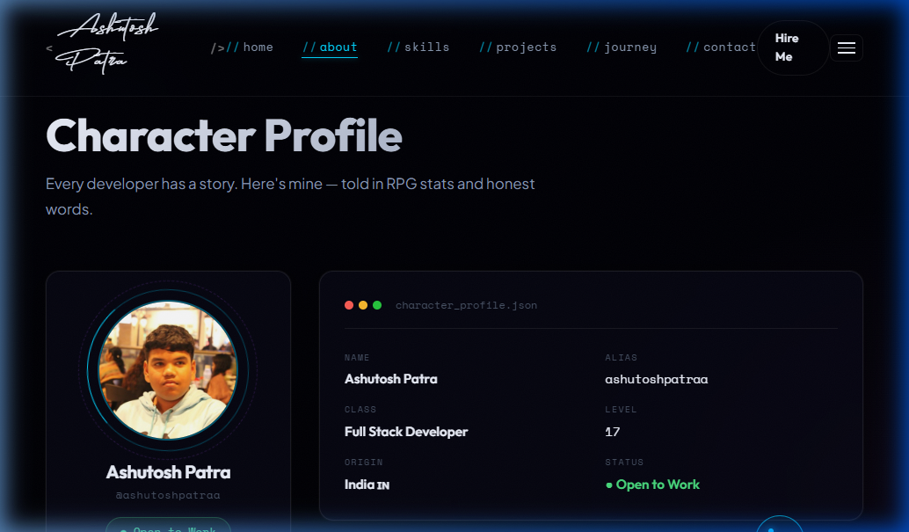
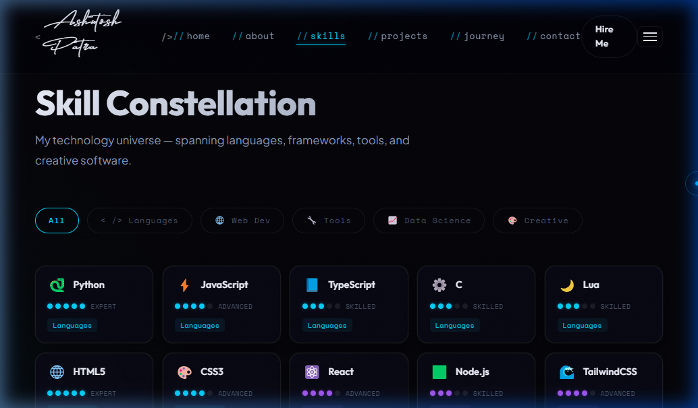
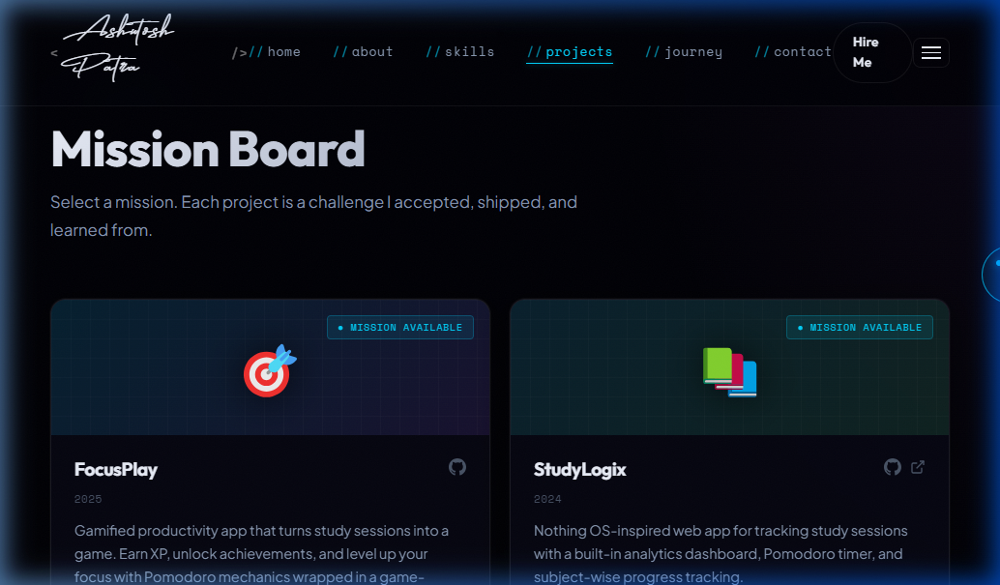
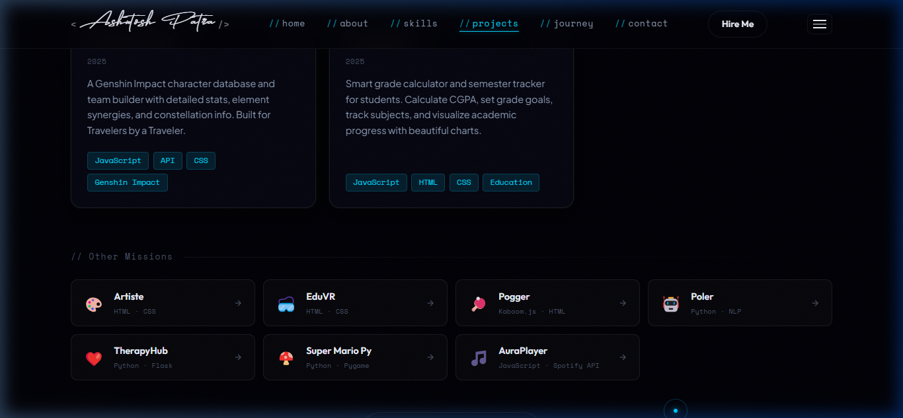
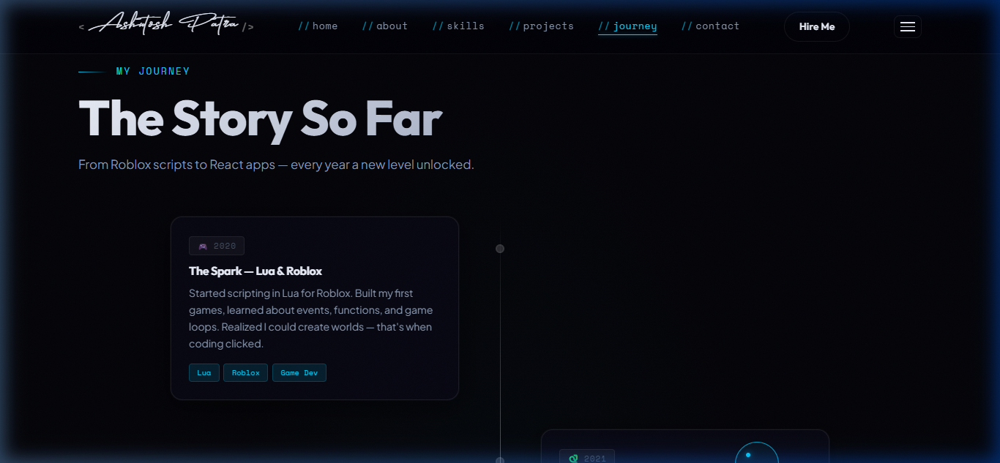
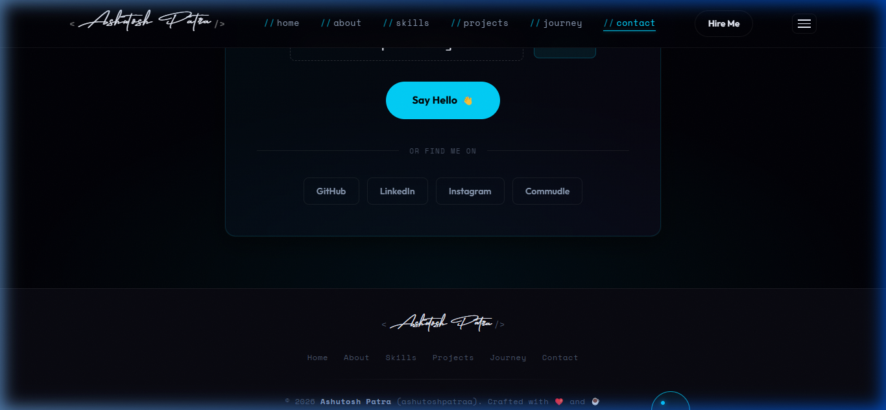

# Ashutosh Patra | Developer Portfolio

A premium, interactive, 3D portfolio built with **Vite, React, TypeScript, Three.js, Framer Motion, and GSAP**.

🌐 **Live Website:** [ashutoshpatra.tech](https://ashutoshpatra.tech)

---

## 📸 Screenshots

### Hero Section (with Interactive 3D Particles)


### About Me (RPG Style Character Profile)


### Skills Constellation


### Projects & Missions



### Journey & Timeline


### Contact


---

## 🛠️ Tech Stack

- **Framework:** React + TypeScript via Vite
- **Styling:** Vanilla CSS (CSS Variables for themes) + TailwindCSS for utility classes
- **3D Graphics:** Three.js + React Three Fiber + Drei
- **Animations:** Framer Motion (Page transitions, scroll effects) + GSAP (Loading sequences)
- **Deployment:** GitHub Pages (via GitHub Actions)

## 🚀 Key Features

- **High-Performance 3D Scene:** Adaptive particle system that scales down on lower-end devices to ensure smooth 60fps.
- **Glassmorphism UI:** Translucent frosted-glass aesthetic applied dynamically across the website.
- **Custom Mouse Physics:** The website incorporates a custom lagging cursor ring, and parallax effects applied on scroll and hover.
- **Component-Driven Architecture:** Clean codebase organized by modular sections and reusable hooks.

## 💻 Local Development

1. **Clone the repository:**
   ```bash
   git clone https://github.com/ashutoshpatraa/ashutoshpatraa.github.io.git
   cd ashutoshpatraa.github.io
   ```
2. **Install dependencies:**
   ```bash
   npm install --legacy-peer-deps
   ```
3. **Run the local dev server:**
   ```bash
   npm run dev
   ```
4. **Build for production:**
   ```bash
   npm run build
   ```

## 📜 License
This project is open-source and available under the [MIT License](LICENSE).
